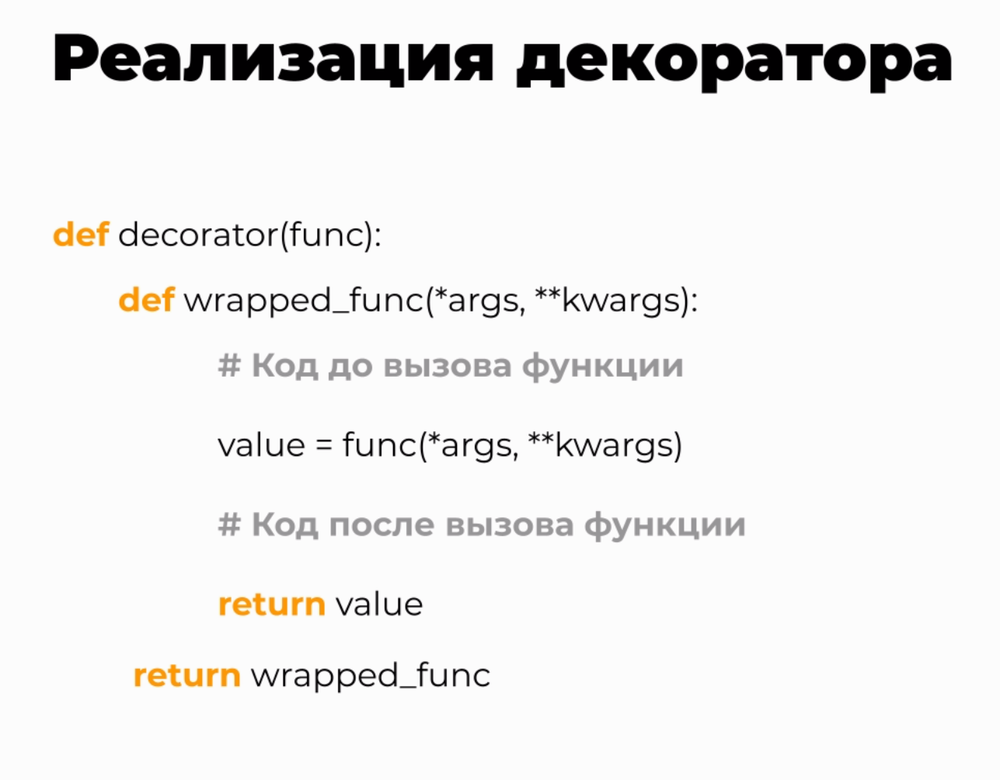

## Стандартный шаблон для создания объекта декоратора разного уровня сложности
def decorator(func):                    # декоратор с параметром - функцией
    def wrapper(*args, **kwargs):                      # внутренняя функция-обертка
        # код до вызова функции
        value = func(*args, **kwargs)
        # код после вызова функции
        return value                    # возврат результата выполнения внутренней функции-обертки 
    return wrapper                      # возврат функции-декоратора 

@decorator
def some_func(*args, **kwargs):
    pass

## Декоратор является одним из шаблонов проектирования в программировании, наряду с итераторами и генераторами
Декораторы полезно использовать для расширения возможностей функций без их изменения и без повторного написания кода.

Минусы декоратора:
- отладка кода затруднена, т.к. при выполнении функции в отладчике мы сначала попадаем в функцию-обертку, 
которая может быть весьма громоздкой   