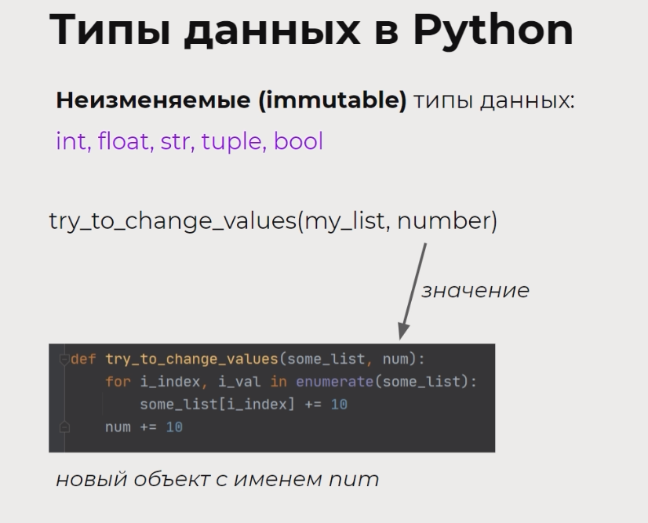
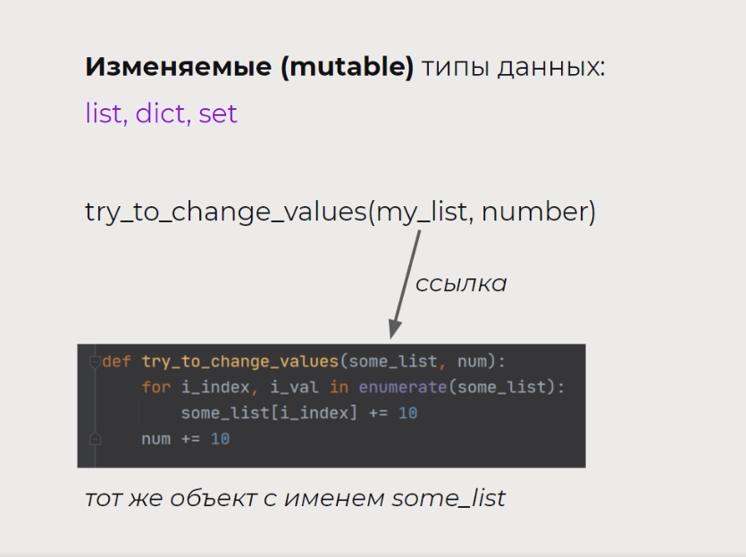

### Типы данных в Python
#### Неизменяемые (immutable) типы данных:
- Целые числа
- Вещественные числа
- Строки
- Кортежи
- Булевы значения
 
Неизменяемые типы данных передаются в функцию именно по значению (т.е. передается не ссылка на весь объект 
(где содержатся id, тип, значение, количество ссылок на объект), а только его значение). 

#### Изменяемые (mutable) типы данных:
- Списки
- Словари
- Множества

Изменяемые типы данных передаются в функцию именно по ссылке.

### Основные моменты ###
1. Переменные — это ссылки на область памяти с объектом, а не сам объект.
2. На один объект может ссылаться несколько переменных. 
3. Если мы вносим какие-то правки в изменяемый объект, то это будет отражено во всех переменных, 
которые ссылались на этот объект.
4. Чтобы изменения в одной переменной не касались другой переменной, нужно использовать копирование объектов 
(чтобы каждая переменная ссылалась на свой объект).
5. Копирование можно выполнять при помощи срезов (сделать срез со всеми элементами) или при помощи 
специального метода copy (или deepcopy из модуля copy).